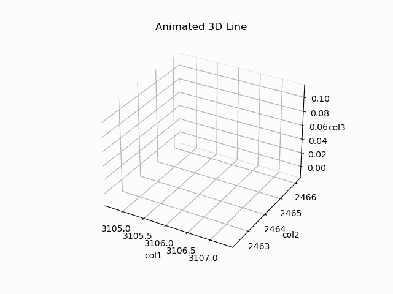
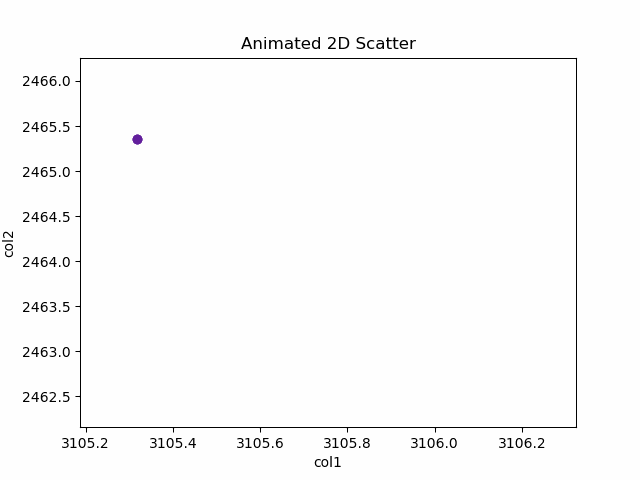
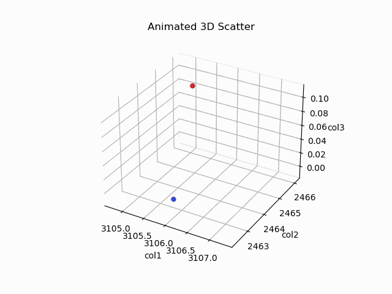

# Simple CSV Grapher 
**When running the following script make sure that your ```log/``` folder is at the same directory level as this script.**


## Table of Contents
- [Python3 Prerequistes](#python3-prerequistes)
- [Usage](#usage)
    - [Command line](#command-line)
    - [YAML Config File](#yaml-config-file)
- [Animated Graphs](#animated-graphs)
    - [Supported Graphs Types](#supported-graph-types)
- [Known Issues](#known-issues)

## Python3 Prerequistes:
```bash
$ pip install matplotlib pyyaml numpy
```
## Usage
This script can be run in two distinct manners (command line and configuration file). To graph data from a single csv command line may be the quickest option, though the other option still works. For graph data from multiple csv files the yaml configuration is only option.  
### Command line
This method allows the user to plot and save a .png file based on a specified csv file. It only support one file at a time. 
```
usage: CSV Graphing [-h] [-p PATH] [-f FILE] [-c COLUMN_NAMES [COLUMN_NAMES ...]] [-g GRAPH_TYPE] [-t TITLE] [-a]
                    [-s] [-y YAML]

A simple program that graphs data from csv files.

options:
  -h, --help            show this help message and exit
  -p PATH, --path PATH  Path to desired file (leave blank if parent directory is log/).
  -f FILE, --file FILE  Desired CSV file.
  -c COLUMN_NAMES [COLUMN_NAMES ...], --column-names COLUMN_NAMES [COLUMN_NAMES ...]
                        Give desired column headers (leave spaces between each header).
  -g GRAPH_TYPE, --graph-type GRAPH_TYPE
                        Choose one of the following ["line", "line3d", "scatter", "scatter3d", "scatterh",
                        "hist", "stem"]
  -t TITLE, --title TITLE
                        Provide title for generated graph.
  -a, --animated        Creates an animated graph when true (will be saved as a gif).
  -s, --save            Save graph.
  -y YAML, --yaml YAML  Generate graph via yaml config file.
```
Go to ``` python3 CsvGrapher_v2.py -h``` for an up to date description on how to use the command line. 

Here's an example of how to use the command line.
```bash
$ python3 CsvGrapher_v2.py -p "path/to/file" -f filename.csv -c header_1 header_2 -g "line" -t "Example Line Graph" -s
```
### YAML Config File
Graphing multiple csv files requires the use of the yaml configuration method. To use this method run ```-y``` with the name of the yaml file (makes sure the yaml file is at the same level as this script). The following fields are used when writing a yaml file.
- **```files```** is the keyword used to find all the files that will be used to generate a graph. 
- **```path```** is the path to find the csv file from within the ```log/``` directory. If the file is directly in the ```log/``` directory put empty single quotes ```''``` in this field.
- **```name```** is the csv filename. Using the keyword ```latest``` will grab the last generated file alphabetically. Using the keyword ```lastModified``` will grab the last modified file.  
- **```headers```** correlates to the column names that will be searched when retrieving data. Should be provided as a list of strings. 
- **```labels```** correlates to the x, y and z labels (only supports one of each). The z label is option.  
- **```title```** is the title of the generated graph. 
- **```type```** determines what type of graph will be generated. Currently supports: line graphs (2D and 3D), scatter plot (2D and 3D), scatter plot with histograms, histogram and stem plot.
- **```save```** is a boolean value that determines whether the graph is saved (when true) or just plotted (when false).

Here's an example of how a yaml file can be made.

```yaml
files:
  - file1:
      path: path/to/file1
      name: file1.csv
      headers: [col1, col2]
  - file2:
      path: path/to/file2
      name: file2.csv
      headers: [col1, col2]
labels:
  x_label: col1
  y_label: col2
title: Example Scatter Plot
type: scatter
save: false
```

Here's an example of how to run the script with the  yaml config file.
```bash
$ python3 CsvGrapher_v2.py -y example.yaml
``` 
Example output:


## Animated Graphs
Both graphing methods: command line and yaml configuration file can take advantage of animated graphs as long as the graph specified is supported. If animation is enabled the save flag is disabled as all animated graphs are automatically saved as a gif in ```log\animated```. 

### Supported Graph Types:
2D Line Graph


3D Line Graph



2D Scatter Plot



3D Scatter Plot



## Known Issues:
- If multiple plots are used in a graph, all of them will be the same color (animated graphs only). 
- For animated graphs, the speed of animation does not scale to the size of the data. Therefore, larger files will result in slow, large gifs, while small files will result in quick, small gifs.